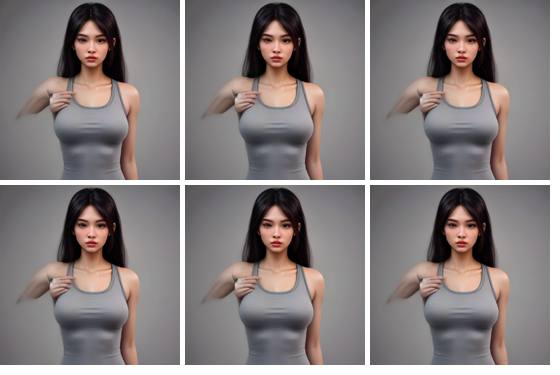

# Clearing the exercise imagery

**The problem in one line:** the photographs the app shows come from a dataset whose maintainer
never said where he got them, and a public-domain dedication cannot cover material he did not
own. That is tolerable for a hobby project that links rather than copies. It is not tolerable
once the app asks anyone for money.

This document is the plan to replace them with artwork this project owns outright, and the
record of what was ruled out and why.

> **Nothing in the app changes yet.** Everything here is tooling and evaluation. The app keeps
> behaving exactly as it does now until the artwork is good enough to swap in.

---

## 1. What is actually wrong

| | |
|---|---|
| Where they come from | [yuhonas/free-exercise-db](https://github.com/yuhonas/free-exercise-db), released under the Unlicense |
| What that covers | What the maintainer wrote. Not photographs he did not shoot. |
| What the README says about the images | Nothing. It credits an upstream dataset and a favicon. |
| Who asked | [Issue #2](https://github.com/yuhonas/free-exercise-db/issues/2), closed with no reply. [Issue #12](https://github.com/yuhonas/free-exercise-db/issues/12), the same. |
| How many are affected | 873 of 896 exercises carry photograph paths |
| How the app uses them | Stores the path, the phone fetches the file from `raw.githubusercontent.com` at runtime |

The chain of title is broken at the first link. Nobody can produce a licence because nobody has
one.

**The best argument available today is that the repository copies nothing:** it holds paths, and
the device fetches the files. That argument is real and it is weaker than it sounds. Inline
linking is unsettled in the US (*Perfect 10* permitted it, *Goldman v. Breitbart* did not), and
in the EU it turns on whether the linker knew the source was unauthorised. This repository has
it written down that we know. Adding a donation button makes the use commercial, which is the
factor most likely to tip it.

### The same defect, in the text

`instructions` came from the same dataset with the same broken chain of title, and the prose is
expressive rather than functional:

> "Using a medium width grip (a grip that creates a 90-degree angle in the middle of the
> movement between the forearms and the upper arms)..."

It has to be dealt with in the same pass. The structured fields are fine: names, muscles and
equipment are facts.

### Everything else in the repo is clean

Checked: all 24 runtime dependencies are MIT and gated by `npm run licenses`; system fonts only,
no bundled webfont; Ionicons via `@expo/vector-icons`, MIT; coach videos are external links, never
embedded; `MuscleGlyph.tsx` is ours. One thing to confirm: nothing records who made
`assets/brand/icon-source.png`.

---

## 2. Ruled out, and why

**Filtering, cartooning or "converting" the existing images.** This is the tempting one and it
does not work. A stylised version of their photograph is a **derivative work**, and preparing
derivative works is one of the exclusive rights of the copyright holder. More pipeline stages do
not help: a derivative of a derivative still traces back, and the pipeline itself is evidence of
where you started. Rotation and mirroring are legally nothing.

**A loop that converges on the original.** Worse than the above. An optimiser whose objective is
"minimise the difference between my output and their image" is, in code, an optimiser for
substantial similarity, which is the legal test itself. It also needs their file present at every
iteration. The better it works, the more infringing it gets.

**Wikimedia Commons as the primary source.** Not a licensing problem, a content one. For three
sample exercises it returned an empty bench with no lifter (CC0), a cropped torso that never
shows the movement, and a stability-ball crunch filed against a plain floor crunch. Different
person, gym and crop every time.

**Buying a commercial set.** Clean, and the licence almost certainly forbids redistribution,
which a public Apache-2.0 repository cannot accommodate without hosting the files off-repo.

**Shipping on the muscle glyphs alone.** Zero risk, zero cost, and rejected: real imagery is a
requirement.

---

## 3. The plan

Generate the set from **text**, never from their pixels. The reference is a written spec of how
the movement is performed, derived from catalog facts. How a bench press works is a procedure,
and procedures sit outside copyright.

```
spec  ->  generate  ->  score against spec  ->  amend prompt  ->  accept
```

The loop asks *"is this a correct depiction of this spec"*, never *"is this close to their
picture"*. Same convergence behaviour; the target was the only thing that was ever wrong.

### The model licence matters as much as the provider

There are two FLUX models and the difference is the whole of this section.

**FLUX.1-schnell is Apache 2.0.** Commercial use of the weights and of the outputs, no
conditions. Every free provider below serves schnell.

**FLUX.1-dev ships under a non-commercial licence, and that governs the weights you download.**
It does not describe every route to the model. **fal.ai and Replicate hold commercial licences
from Black Forest Labs and pass those rights to the outputs you generate through them.** So dev
is usable for this project through a licensed host, and only through one. Downloading the dev
weights and running them on the RTX 3050 for this project would not be.

The trap is still real and worth stating plainly: dev is the better-looking model and the
default in half the tutorials online, so it is easy to end up self-hosting it by accident. The
local provider is pinned to schnell for exactly that reason.

### The providers, in the order to try them

| Order | Provider | Model | Cost | Full catalog, 1,792 frames |
|---|---|---|---|---|
| 1 | **Cloudflare Workers AI** | schnell, Apache 2.0 | free, 10,000 neurons/day, about **2,000 images/day** | **free**, one day |
| 2 | **Hugging Face router** | schnell, Apache 2.0 | about $0.10/month of credit, so a few dozen images | not viable for a full pass |
| 3 | **Local, RTX 3050** | schnell, Apache 2.0 | free, unlimited retries | **free**, ~45 h of compute |
| 4 | **fal.ai** | **dev**, licensed by the host | $0.025/megapixel, and 768px is one | **~$45** a pass |
| 5 | **Replicate** | **dev**, licensed by the host | about $0.03 an image | **~$54** a pass |
| - | Gemini image | Google | $0.039 an image | ~$70 a pass |

**Path 2 stopped being free while this document was being written.** The endpoint the plan
assumed, `api-inference.huggingface.co`, no longer resolves at all, and its replacement answers
410 for this model: Hugging Face now forwards text-to-image to third-party hosts (nscale, fal-ai,
wavespeed) and bills them against an account credit worth about $0.10 a month on a free plan.
The model and its Apache-2.0 licence are unchanged, so the path is still worth running to compare
quality, but it can no longer render the catalog. Cloudflare and the local card are the two free
paths now.

Two things fall out of that table that were not obvious before pricing it.

**dev is cheaper than Gemini**, not dearer, and it is the better model for this job. If the free
schnell passes come out weak, fal.ai is the next stop rather than Gemini.

**None of this needs a real budget.** The worst case, the whole catalog twice on the dearest
option, is under $150. Cost was never going to decide this. Quality is.

**Spec writing and scoring always run on Gemini's free text and vision tier**, whichever provider
renders the image. Only Gemini's *image* generation costs money. So Cloudflare plus Gemini
scoring is a pipeline that costs nothing at all.

### Expected quality trade

FLUX-schnell is a 4-step distilled model: fast, and weaker than Gemini on complex anatomy.
Exercise poses are the hard case, so expect a higher rejection rate. That is what the loop and
the fallback tiers are for.

### The fallback chain, once the set exists

| Tier | Source | Licence |
|---|---|---|
| 1 | Generated, review passed | Ours, no conditions |
| 2 | Everkinetic via wger | CC BY-SA 3.0, credited |
| 3 | `MuscleGlyph`, already shipped | Ours, Apache 2.0 |

Tier 2 is line art, so it is a floor rather than a goal. Tier 3 already serves 23 exercises today
and nobody has noticed.

---

## 4. Running it

### The keys, and where they go

**Where:** a `.env` file in the repository root. Copy the template and fill in only the path you
are running:

```bash
cp .env.example .env
```

`.env` is already in `.gitignore`, alongside `.env.*`, with `!.env.example` so the template
itself stays tracked. The npm scripts load it automatically through Node's
`--env-file-if-exists`, so nothing needs exporting by hand and nothing lands in your shell
history. **No key ever goes in the repository**, which is the same rule that kept the feedback
address out of the bundle.

**Which keys, per path.** Only the row you are running matters, plus the first line, which every
path needs:

| Path | Keys | Cost |
|---|---|---|
| **Every path** | `GEMINI_API_KEY` | free. Spec writing and scoring run on Gemini's text and vision tier whichever provider renders the pixels. |
| **1. Cloudflare** | `CLOUDFLARE_ACCOUNT_ID`, `CLOUDFLARE_API_TOKEN` | free |
| **2. Hugging Face** | `HF_TOKEN` | a monthly credit worth about $0.10 on a free plan, enough to compare quality |
| **3. Local** | `LOCAL_IMAGE_URL` | free, and not a key: the address of your own server |
| **4. fal.ai (dev)** | `FAL_KEY` | paid, about $45 for the catalog |
| **5. Replicate (dev)** | `REPLICATE_API_TOKEN` | paid, about $54 for the catalog |

**Where each comes from**

| Variable | Where to get it |
|---|---|
| `GEMINI_API_KEY` | [aistudio.google.com/apikey](https://aistudio.google.com/apikey) |
| `CLOUDFLARE_ACCOUNT_ID` | dash.cloudflare.com, right-hand sidebar |
| `CLOUDFLARE_API_TOKEN` | Profile > API tokens > Create, "Workers AI" template |
| `HF_TOKEN` | [huggingface.co/settings/tokens](https://huggingface.co/settings/tokens), read scope |
| `FAL_KEY` | [fal.ai/dashboard/keys](https://fal.ai/dashboard/keys) |
| `REPLICATE_API_TOKEN` | [replicate.com/account/api-tokens](https://replicate.com/account/api-tokens) |

The script names exactly what is missing for the path you asked for, so you can also just run it
and let it tell you.

**Two free ones start everything.** Add `FAL_KEY` only when you want dev beside them.

```bash
cp .env.example .env    # then fill in GEMINI_API_KEY and the Cloudflare pair

npm run art -- --provider cloudflare --probe    # one image, see the house style
npm run art -- --provider cloudflare --limit 10 # the trial
npm run art:sheet                               # side-by-side review page
```

Then open `assets/generated/review.html`. It puts every exercise in a row and every provider in a
column, start frame beside end frame, so the comparison is the point rather than an afterthought.

Repeat with `--provider huggingface`, `--provider local` and `--provider fal`, on the same ten
exercises. The review page picks up each provider automatically and puts them side by side,
which is the only way to judge this.

**Judge the style before generating anything at scale.** If it does not hold across a squat, a
cable fly and a plank, the fix is the `STYLE` paragraph in
[`scripts/build-exercise-art.mjs`](../scripts/build-exercise-art.mjs) and nothing else.

### Running locally on the RTX 3050

6GB of VRAM will not hold FLUX-schnell at full precision. Use a quantised GGUF build under
ComfyUI, or `diffusers` with sequential CPU offload, and expose a tiny HTTP endpoint that takes
`{"prompt": "..."}` and returns the image. Then:

```bash
export LOCAL_IMAGE_URL=http://127.0.0.1:8188/generate
npm run art -- --provider local --limit 10
```

System RAM is the tighter constraint here, not VRAM: offloading needs somewhere to put the
weights, and this machine has about 5GB free.

---

## 5. Order of work

1. **Quality first.** Ten exercises through Cloudflare, then Hugging Face, then local. Compare on
   the review page. Nothing else starts until the artwork is worth shipping.
2. Generate the head of the catalog, the 200 exercises people actually log, and check every frame
   by eye.
3. Fill gaps from the Everkinetic tier, recording `license`, `license_author` and
   `license_derivative_source_url` per file.
4. Generate the tail; accept a lower hit rate; glyph the remainder.
5. Only then touch the app: swap the image source, add the credits screen, rewrite
   `THIRD-PARTY-NOTICES.md` §2, and repoint `src/__tests__/notices.test.ts` at the new claims.
6. Deal with `instructions` in the same pass.

---


---

## 6. Progress log

Kept here so the effort has a record rather than living in a chat window. Newest first.

### 2026-08-21: path 2 run with a real key, and it is no longer a free path

Ran the real pipeline end to end for the first time, with a Gemini key and a Hugging Face token.
Three exercises, both frames, three attempts each.

**Path 2 has changed underneath the plan.** `api-inference.huggingface.co` does not resolve at
all any more, and its replacement returns 410 for FLUX.1-schnell. Hugging Face now forwards
text-to-image to third-party hosts and bills them against an included credit. On a free account
that credit ran out after **nine images**, mid-run:

> You have depleted your monthly included credits.

So path 2 is a quality sample, not a way to render 1,792 frames. The script now targets the
router (nscale by default, `HF_PROVIDER` to change it) so the sample is at least obtainable.
Section 3 has been corrected.

**Gemini image generation needs billing.** The text and vision calls are free as planned and
worked throughout, but `gemini-3.1-flash-image` answers 429 on a key with no billing attached.
The paid fallback is a real fallback, not a free one, and it needs a card before it is a route.

**The model names in the script had gone stale.** `gemini-2.5-flash` now answers 404 with "no
longer available to new users"; the defaults are `gemini-3.6-flash` for text and vision and
`gemini-3.1-flash-image` for the paid image path.

**Quality: schnell got every frame wrong.** Nine renders, zero accepted. The scorer's own words,
which are worth reading because they are specific rather than vague:

- squat: barbell held in front of the clavicles instead of racked across the trapezius, front
  view where a three-quarter view was asked for, depth well above parallel
- bench: barbell floating in mid-air unheld, plates detached and drifting near the head, one
  arm raised in a fist and no bar in it, and on the third attempt an arm growing from the hip

That last one is the tell. Schnell is a four-step distilled model and it is weak exactly where
this project needs strength: equipment contact points and limb topology. The spec-and-score loop
is doing its job by catching all of it, but a loop that rejects everything produces nothing.

**What this changes.**

- **Cloudflare is now the only free path worth a full run**, with the local card behind it.
  Path 2 drops to a sample.
- Schnell may simply not be good enough at this, in which case fal.ai with dev at about $45 is
  the answer rather than a fallback. That is the next comparison, and it needs the Cloudflare
  keys first so there is something to compare against.
- Rejected frames are now written to disk and shown on the review page with the faults named
  underneath. Discarding them was a mistake: a trial whose output is an empty folder cannot
  answer the question the trial exists to ask.
- Transient failures now retry with backoff. A single Gemini 503 was abandoning a frame, and
  over 896 exercises that is not an edge case.

### 2026-08-18: first generation trial, and a correction worth having

**A correction to section 3.** "FLUX.1-dev is non-commercial" is true of the *weights you
download* and not of every route to the model. Hosted providers including **Replicate and
fal.ai license dev commercially and pass those rights to the outputs you generate**. So dev is
usable for this project after all, via a paid host, and it is the quality ceiling. Schnell
remains the right default because it is free and Apache 2.0 either way; dev via a licensed host
becomes the paid fallback in place of Gemini if its anatomy proves better.

**The trial itself ran without any provider key**, on a keyless endpoint, purely to see whether
the spec-then-generate approach produces anything usable. It is not one of the three planned
providers, so it says nothing about them. It did produce two findings.

**Finding 1: long prompts get dropped.** Three exercises, both frames, using the full `STYLE`
paragraph plus a hand-written spec. Six requests, six identical portraits, and not one barbell,
bench or plank anywhere:



**Finding 2: the same idea works when the prompt is short.** Same service, same seed discipline,
a one-line description instead of a paragraph:


Recognisably barbell squats. Also visibly imperfect: a mangled face on the left, a bar that is
not convincingly racked on the shoulders, and a gym background that contradicts the neutral
studio the style asks for.

**What this changes.**

- The spec-driven approach is sound: describing the movement in facts and generating from that
  does produce the right exercise.
- **Prompt length is a real variable.** The `STYLE` paragraph is currently 60-odd words before
  the spec is even appended. Cloudflare accepts 2,048 characters on schnell so this is unlikely
  to bite there, but it is now a thing to check per provider rather than assume.
- Faces and hands are the weak point, as expected. Worth trying a style that keeps the face away
  from the camera, since no exercise illustration needs a recognisable face and every generator
  is bad at them.
- Nothing here is a verdict on Cloudflare, Hugging Face or local schnell. Those need keys.

**Still needed to proceed:** `GEMINI_API_KEY` (free) plus `CLOUDFLARE_ACCOUNT_ID` and
`CLOUDFLARE_API_TOKEN` (free). See section 4.

> The two images above are evaluation artefacts, not app assets. Nothing generated in a trial
> ships; the shipped set comes from the reviewed pipeline.

### 2026-08-18: half the figures are female now

Unrelated to licensing, found while working on it. Sex is optional in the profile and
"Unspecified" is a real answer, but it was handled as a missing one: choosing it set the body
figure to male, so the single option a person picks in order not to be assumed about produced
exactly that assumption, silently.

- Exercise pages now split the figure evenly across the catalog, assigned deterministically from
  the exercise id: **457 female, 439 male**. Stable across reinstalls and restored backups,
  because it is a pure function of the id rather than anything stored.
- The Body tab still draws whichever figure you choose, since that one is you rather than an
  exercise, and it now has its own control instead of being inferred from your sex.
- The generation pipeline uses the identical hash, so a generated photograph and the drawn glyph
  underneath can never disagree about the same exercise.

See [`src/lib/figure.ts`](../src/lib/figure.ts).

---

*Not legal advice. This is an engineering assessment of where the material came from and what it
would take to replace it. For a project that will take money, a short conversation with a
solicitor about the linking question is cheap insurance.*
